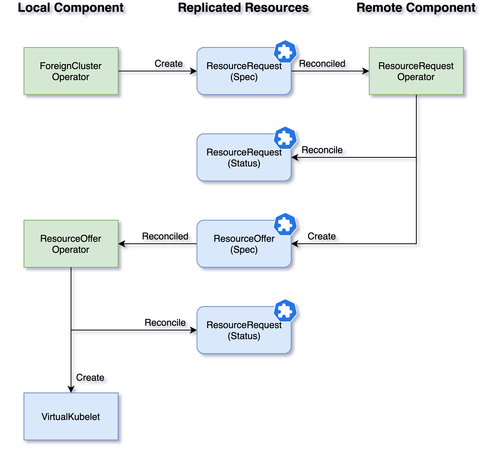

## Overview

During the peering process, the _Liqo Control Plane_ exchanges some shared CRs among different clusters.
It achieves this goal by exchanging messages with the replication of the CRDs.
The Operators involved in this mechanism reconcile the CRDs locally; the [_CRDReplicator_ component](features/establish-interconnection/#crd-replicator) will propagate these changes to the remote cluster.

The first step is the creation of an identity to be able to communicate with the remote cluster. The local _ForeignCluster Operator_ is in charge of forging a key and a _Certificate Signing Request (CSR)_ and sending the request to the remote Authentication endpoint. That remote service checks if the request can be accepted (the provided token is correct), issues a certificate, and assign to this identity some basic permission. ([Authentication](features/authentication/))

The local cluster can indicate the intention to establish a peering to a remote one creating a _ResourceRequest CR_.
The remote _Liqo Controller Manager (LCM)_ reconciles this resource and (if accepted) forges a _ResourceOffer CR_.
At this point, the local _LCM_ reconciles this last resource and (again, if accepted) it is now able to build a new local _Virtual Kubelet_ that provides a new virtual-node where Kubernetes can schedule new jobs: if a pod is assigned to a _Virtual Node_, it will be actually sent to the respective remote cluster. ([Establish the Interconnection](features/establish-interconnection/))

