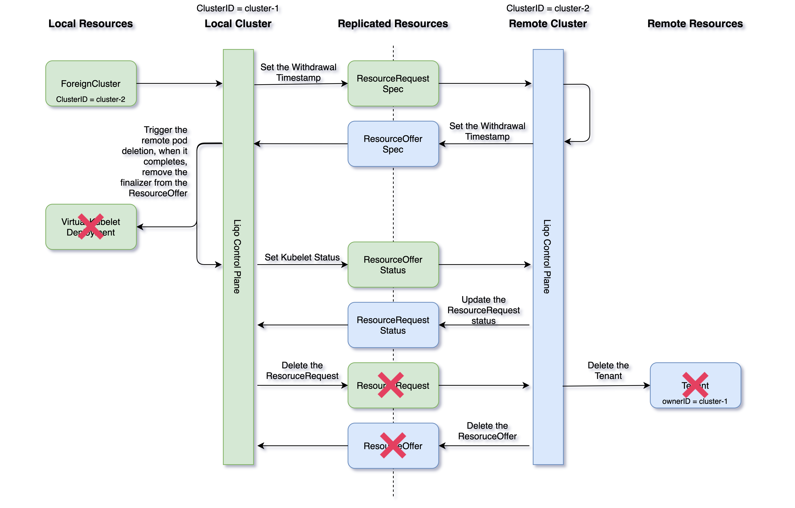

### Overview

The process that establishes the interconnection between the clusters is in charge of sharing the information that two clusters will use this information to coordinate the peering.
They need to know when the peering is required, the amount of resources available for the sharing, and when the interconnection is no more required (and to perform a graceful teardown).

### Tenant Namespace

Each cluster participating in the peering has to provide a Tenant Namespace where the two clusters share the ownership over the resources. Every resource relative to peering with that specific cluster will live in this namespace.

```yaml
apiVersion: v1
kind: Namespace
metadata:
  labels:
    discovery.liqo.io/cluster-id: 48bb07b7-a054-44a0-aa3b-16a9014cfe5b
    discovery.liqo.io/tenant-namespace: "true"
  name: liqo-tenant-48bb07b7-a054-44a0-aa3b-16a9014cfe5b
```

The Tenant Namespace has to have two labels to be handled by the _Liqo Control Plane (LCP)_:

* `discovery.liqo.io/tenant-namespace`: indicates that this is a _Liqo Tenant Namespace_.
* `discovery.liqo.io/cluster-id`: indicates which remote cluster this namespace is assigned to.

#### CRD Replicator

The __CRD Replicator__ component is able to perform the replication of the resources over different _Tenant Namespaces_.

It can operate both on the local API Server and on the remote one creating a client with a valid [identity](../authentication). It establishes a double control loop:

1. enforce the __spec__ of the local resources over the __spec__ of the replicated resources.
2. enforce the __status__ of the replicated resources over the __status__ of the local resources.

Thanks to this mechanism, Liqo is able to use CRDs to communicate with a remote cluster using the resources _spec_ to provide the local decision/status and the resources _status_ to get the answer from the control plane of the remote cluster.


### Peering Management

The _Liqo Control Plane_ manages peering and interconnection between two clusters using two CRDs:

| Resource | Description |
|---|---|
| __ResourceRequest__._spec_ | It indicates the intention of a cluster to establish a peering to the other one. It contains general cluster information to allow the remote to add a _ForeignCluster_ with _incoming peering_ discovery type. |
| __ResourceRequest__._status_ | It indicates if the remote cluster accepted the ResourceRequest. It also tells us when the withdrawal state has been set over the related offer. |
| __ResourceOffer__._spec_ | It contains the amount of resources that a cluster can share with a remote one. These resources will be available for the _Virtual Node_. |
| __ResourceOffer__._status_ | It indicates if the target cluster accepted the offer and the state of the related _Virtual Kubelet Deployment_ to be able to handle a graceful teardown. |

#### Peering SettingUp

When the _Liqo Control Plane_ needs to set up a peering with a remote cluster, it needs to exchange some resources with it.
These shared and replicated resources contain different information, such as the desired state of the peering (up or down) (___ResourceRequest CR___), the amount of resources to assign to the _Virtual Node_ (___ResourceOffer CR___), and the local network configurations (___NetworkConfig CR___).

We can split this process into several different steps:

1. the local cluster creates a __ResourceRequest__ in its Tenant Namespace.
2. the remote _Liqo Control Plane_ sees this new replicated resource and decides to accept or deny it reconciling its status.
    * it can automatically deny a request if that option is set in the related local ForeignCluster CR or as default in the ClusterConfig CR. Manual action will be required to allow the incoming peering.
    * when the request is accepted, there are some side effects in the remote cluster. First, if there is no ForeignCluster CR with the same _clusterID_ of the new incoming connection, it creates a new one. Second, it creates a new [Capsule Tenant](https://github.com/clastix/capsule/blob/master/docs/index.md) settings this _clusterID_ as owner. This Tenant will be used as a Namespace fabric for the offloading of the applications.
3. the remote cluster computes how many resources it can share with the local one and writes it in a new __ResourceOffer__.
4. the local _Liqo Control Plane_ can accept or not the new offer manually or according to a policy in the ClusterConfig CR, and accordingly updates the _ResourceOffer Status_.
5. when the Operator accepts the offer, it creates a new _Virtual Kubelet Deployment_ that will read the _ResourceOffer_ and the _TunnelEndpoint CRs_ to set the available resource on the node and its conditions.


#### Peering TearDown

The _Liqo Control Plane_ does a similar process when the peering is no more required and handles a graceful teardown of the offloaded pods.

We can split this process into several different steps:

1. the local cluster sets a __withdrawalTimestamp__ over the local _ResourceRequest_.
2. the remote _Liqo Control Plane_ reacts over this event setting a __withdrawalTimestamp__ over the _ResourceOffer_ resource.
3. that causes the local _Virtual Kubelet_ to understand to be in deleting phase and handles a graceful migration of the offloaded pods setting the _Virtual Node_ as unschedulable and evicting the pods assigned it respecting the [Pod Disruption Budgets](https://kubernetes.io/docs/concepts/workloads/pods/disruptions/) that could be set.
4. when the cleanup is finished the _Virtual Kubelet_ removes the ___liqo.io/node___ finalizer. The _Liqo Control Plane_ is now able to update the offer status.
5. this change is propagated over the request status that can now safely deleted and the _TearDown_ process can be completed.


